## Hardware based array sorting

This parallel sorting algorithm is based on:

* https://hackaday.com/2016/01/20/a-linear-time-sorting-algorithm-for-fpgas/

* https://github.com/Poofjunior/fpga_fast_serial_sort

This solution handles repeating numbers and sorts arrays of unsigned 8-bit data from size 0 up to N, where N is the total number of sorting cells that we’ve synthesize onto an FPGA. Time complexity for the implemented algorithm is `O(n)`.

----

All cells are empty once the sorting starts. We start by inserting a new element, this new element will be the smallest we’ve seen so far, so it will be inserted into the first sorting cell.

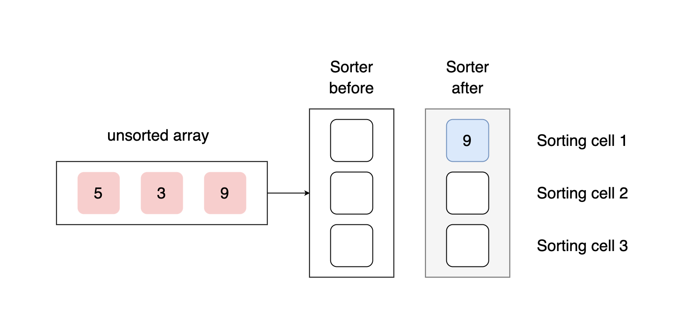

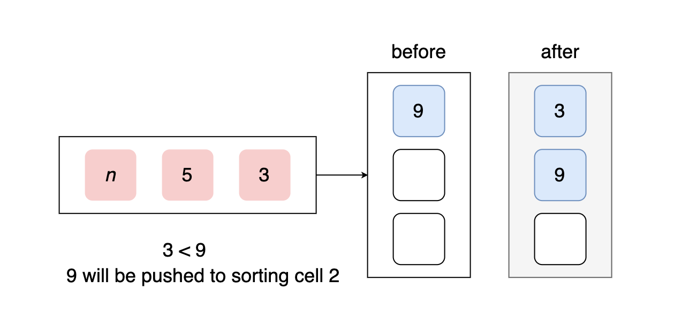

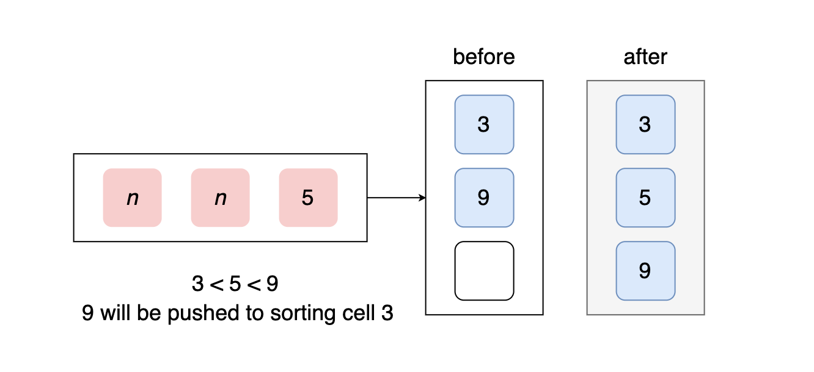

• If a cell is empty, it will claim the incoming element if the above cell is occupied.

• If a cell is occupied, it will claim the incoming element if the incoming element is less than the stored element AND the occupied cell above this cell is not kicking out its element.

• If the cell above the current cell kicks out it’s stored element, then the current cell MUST claim the above cell’s element, regardless of whether or not the current cell is empty or occupied.

• If a cell is occupied and accepts a new element (either from the above cell or from the incoming data), it must kick out its current element.

----
#### Schematic

We read the unsigned 8-bit data (numbers from 0 to 255) from a `2^6-by-8` ROM.

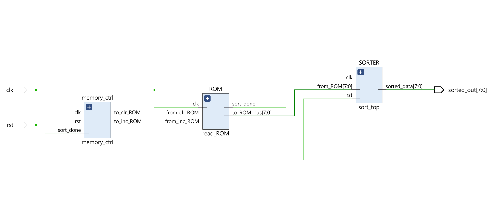

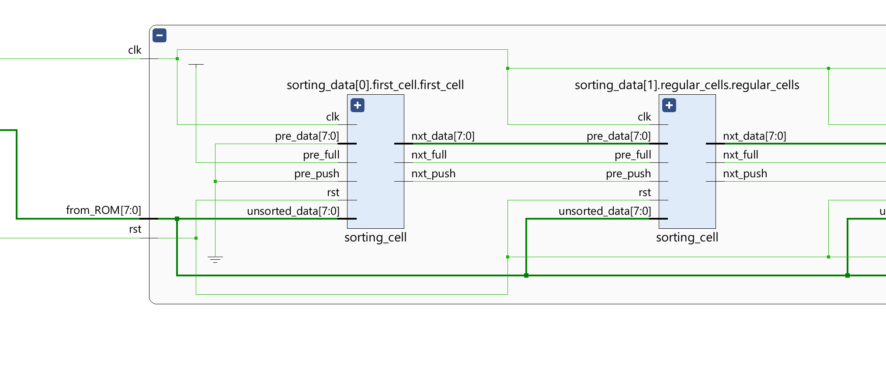
First cell: pre_data doesn't exist since this is the first cell.

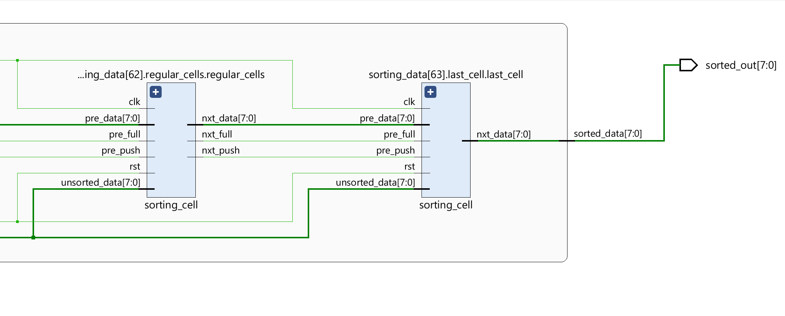

For the last cell we connect `nxt_data` to the `sorted_data` output.

----
#### Testbench
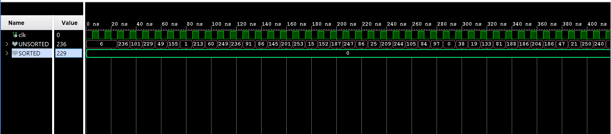

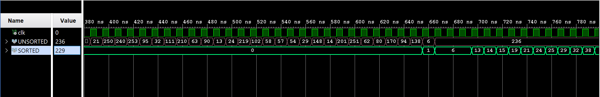

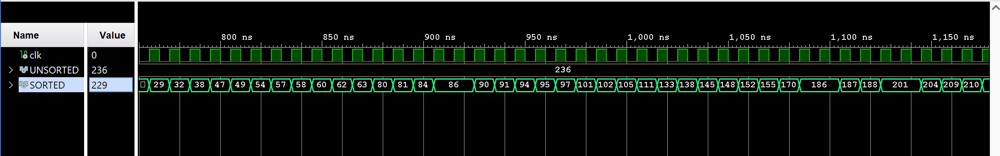

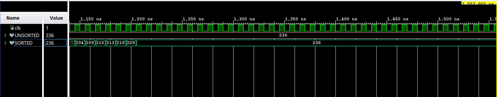

----
#### Synthesis report
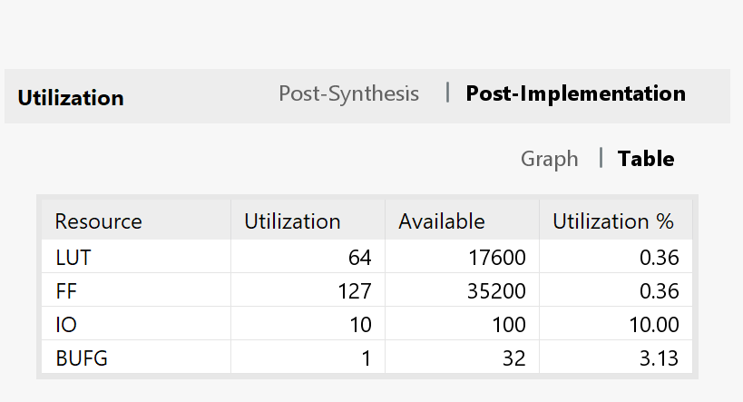

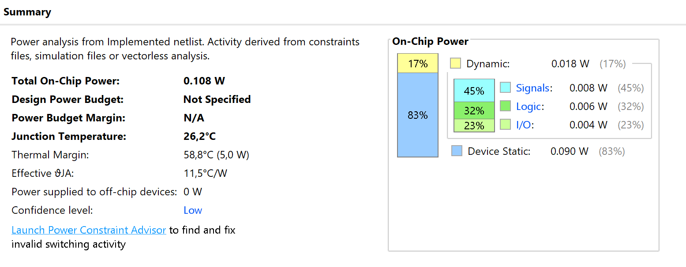
